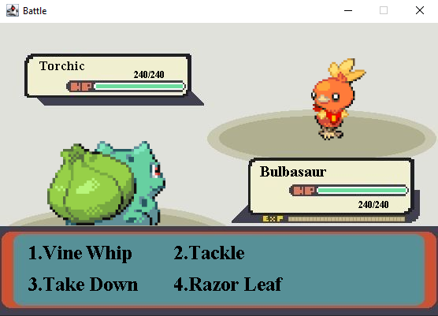

# Terminal-JRPG
JRPG style battle system made for a school project

## About
---
This is a project that I created for a school project. The base project was just to create a JRPG style battle system. In the third part, we were given the choice to improve it in any way you wanted, so I decided to create some graphics for the battle. I wanted to create a full GUI but due to the limited timeframe and since just the graphics were sufficient for full marks, I did not add mouse or keyboard controls in the window. So for these reasons it still has to be controlled from the terminal.

Since base code given for the projects were actual Pokemon, I decided to base the graphics off the actual game.

There is also a small animation for when a monster gets attacked.

## How to Run
---
1. Clone the repo with  ``git clone https://github.com/Crawford-H/Terminal-JRPG.git``
1. Navigate to the folder in terminal
1. Build project with ``gradle build``
1. Run with ``gradle run`` or ``java -cp .\build\classes\java\main\ GameDriver``
1. Enjoy!
